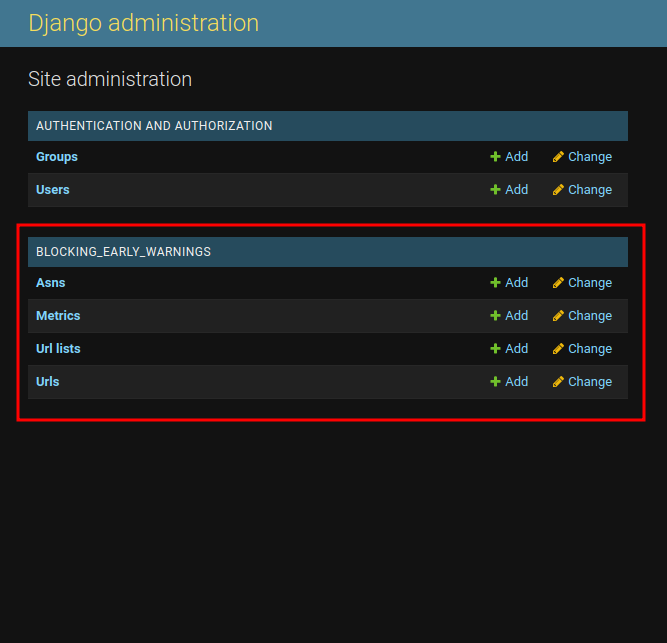

# Early Warnings

The Early Warnings App it's a django app to check for anomalies in web connectivity measurements for 
web pages using [Ooni](https://ooni.org/es/) data, and is maintained by the Venezuelan NGO [Venezuela Inteligente](https://veinteligente.org). 
We aim to provide additional features on the top of the excellent Ooni service that might be useful for digital rights activists around 
the world. 

## Highlights

This app aims to be reusable in your own django projects, as well as a stand alone app. In both cases, the main features are the 
following:

* Sending email notifications whenever a blocking event occurs
* Analysis of aggregated data, trying to find patterns common to generalized blocking events
* Graphs and tools to visualize stored data
* Defining multiple lists of urls that can be automatically updated

## Getting Started

You can use this app either as a **stand alone Django app** using docker, or as **modular app** that you can 
install in your own Django project. In the following tutorial you will learn how to install it in the way that
better fits your use case

### Installing as a standalone app

With this installation you will have a django server running this app in docker with a few commands. In order to do so, 
**you'll need a valid [docker installation](https://docs.docker.com/engine/install/ubuntu/)** (and [post install](https://docs.docker.com/engine/install/linux-postinstall/) is highly recommended). You'll also need the [environment files](./user_guide/env_variables.md). Once you have these, follow the next steps to install the app:

1. Download the code from the [official repository](https://github.com)
        
        git clone https://github.com/VEinteligente/django-blocking-early-warning.git

2. Copy your [environment files](./user_guide/env_variables.md) into the root project directory.

3. `cd` into the root project directory and run the docker installation script:

        ./run_docker.sh

With these steps, the app will be running, but we still need to run migrations in order for it to be useful. We can do this by running the script
`migrate_db.sh` just like we did before with `run_docker.sh`. 

And finally, now that we have initialized the database, we should create a super user to manage the site. We can do this by running the command `docker-compose -f docker-compose.yml exec web python manage.py createsuperuser`. Choose a user and password of your liking and you'll be all set!.

### Installing as part of your Django project

The early warnings app is a regular django app like many others, so the process it's pretty much the same as with any app:

1. Download the the code from the [official repository](https://github.com)

        git clone https://github.com/VEinteligente/django-blocking-early-warning.git

2. **Install the django package with pip**, you have to specify the path to the cloned directory

        pip install -e /path/to/django-blocking-early-warning

3. Back in your django project, you just have to add this app as you'd do with any django app. The first step is 
**add the early warnings app to your installed apps**

        # settings.py

        INSTALLED_APPS = [

            # Your other apps

            "blocking_early_warnings" # new
        ]

4. Now you have to **add early warnings urls to your site**:

        # urls.py
        # ...
        from django.urls import path, include

        urlpatterns = [
            
            # Your other url patterns

            # Note that you might want to change the prefix here so the match
            # your project's guidelines
            path("early_warnings/", include("blocking_early_warnings.urls")) # new
        ]

    !!! note
        Note that this step is entirely optional as you might want to manage urls and views yourself, 
        so feel free to skip it to follow a more suitable installation for you. Otherwise, this is the simplest
        default installation.

5. And last but not least, we have to **run migrations** to add the database tables required by early warnings:

        python manage.py makemigrations blocking_early_warnings
        python manage.py migrate

And that's it, you now have the app succesfully installed in your project. You can check if everything's ok by 
running your server with `python manage.py runserver` and going to your `admin` panel, by default in `http://127.0.0.1:8000/admin/` 
and check for the new tables:

