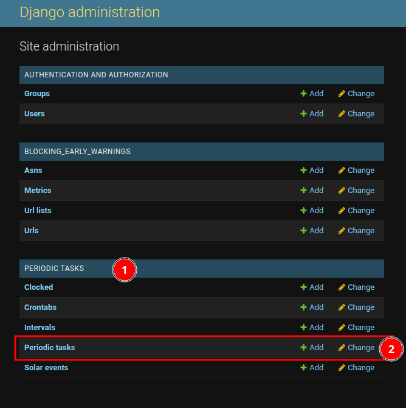
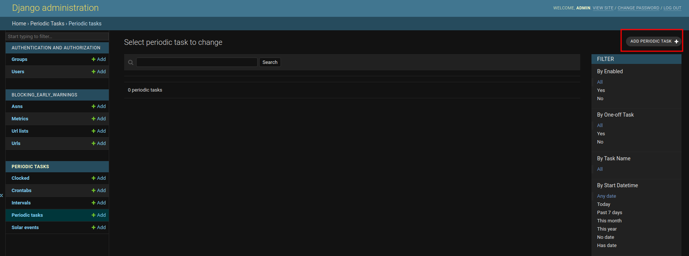
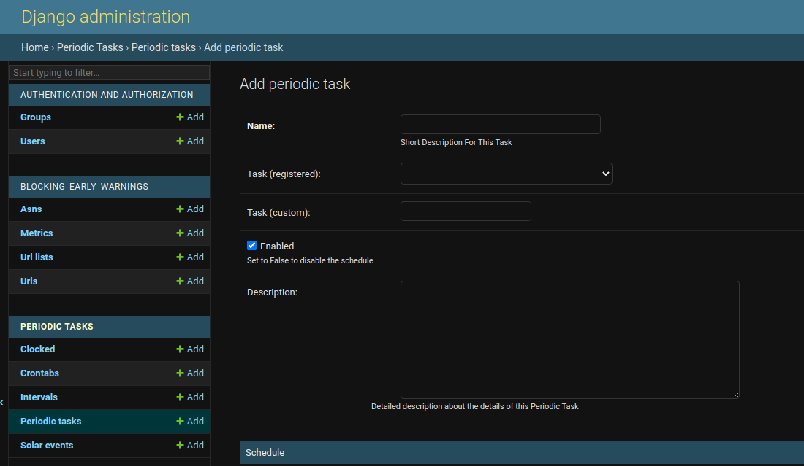
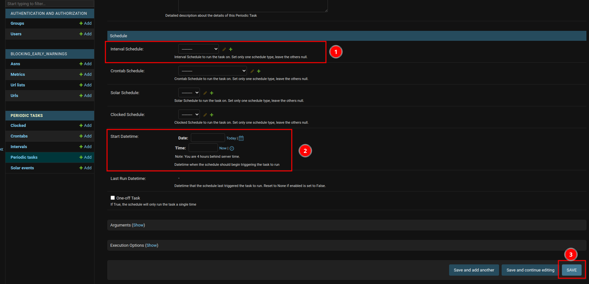

# Asynch Tasks

The Early Warnings app provides a few useful automatic functions that might help you automate common tasks, like 
pulling an updated list of urls, synching with ooni data, and search for anomalies. In this section we will learn what tasks we have available, 
what they do, how to **set them up** for the first time on a standalone installation, and how to **set up its parameters**.

## Tasks
## Synch URL lists

An [URL List](./url_lists.md) is an object that represents a list of urls that might be stored and parsed on some specific ways.
This list can change over time, and therefore **it will need to be updated locally** to reflect such changes. This Asynch task does exactly 
that. It will pull the updated list according to the specified type of list and update the database to have the same urls.

If you're **using this library as a Django app**, you can import this task using:

```python
from blocking_early_warnings.tasks import synch_urls
```

And its name is `blocking_early_warnings.synch_urls`, you might use it this way to add it to your celery scheduler.

## Synch DB metrics

This function will sync data from ooni to the local database so that information about each page is up to date. This is important
to catch any new anomalies. You can import it using:

```python
from blocking_early_warnings.tasks import synch_db_metrics
```

And the task name is `blocking_early_warnings.synch_metrics`, this is the name you might want to use for your scheduler.

## Monitor anomalies

This task will run an anomaly inspection on **currently stored data** to find any new anomaly. For this function to return meaningful results, data must be up to date in order to find new problems, and therefore is highly recommended to use this task along with the **Synch DB metrics** task. You can import it using:


```python
from blocking_early_warnings.tasks import monitor_anomalies
```

This task's name is `blocking_early_warnings.monitor_anomalies`, use it to schedule this task in your scheduler.

## Scheduling tasks with a stand alone deployment

If you're **using this library as a standalone app**, you can schedule tasks using the admin panel. Go to the admin page in `/admin` and search for the 
**Periodic Tasks** <span style="color:red">**(1)**</span>. section, here we have a few options to schedule this task:




There's multiple options here about how to schedule a task and you can find details about each of them [here](https://django-celery-beat.readthedocs.io/en/latest/), but the easiest way is to go with a **periodic task** . A periodic task is just a task that's repeated in regular time intervals. Click on the link corresponding to the periodic task <span style="color:red">**(2)**</span> and this will open the list of available tasks, which will be empty since we have not created any task yet. 



Now click on the **Add periodic task** button to open the task creation form.



This form has two parts, the first part **specifies the task** itself, you can provide a human-readable name 
for this async task, select the task you want to run periodically, and a description for yourself. The possible options for tasks are the ones already mentioned in this guide. 



The second part corresponds to **scheduling**  the new task. Again, there's many options to specify a scheduling, but the easiest to use is **interval scheduling** <span style="color:red">**(1)**</span>, we specify a time interval for the task and it will run every specified amount of periods. You might need to create an interval of your liking to assing to the task by clicking in the <span style="color:green">**+**</span> button. 

Then we specify the date and time we want this task to start <span style="color:red">**(2)**</span>, you can choose "today" and "now" to start them right away. Finally, we click on save <span style="color:red">**(3)**</span> to start this task. 

