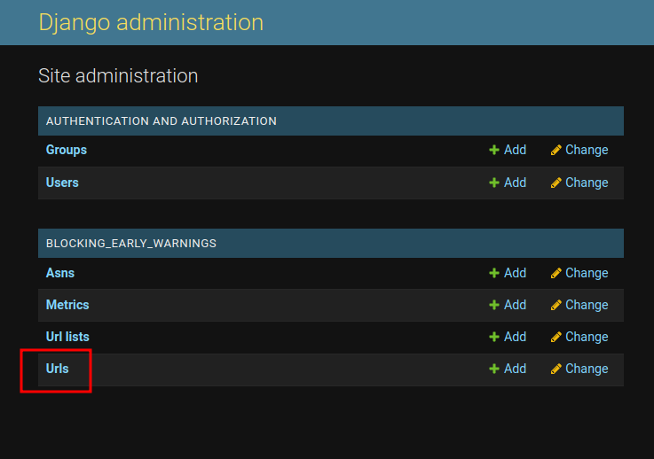
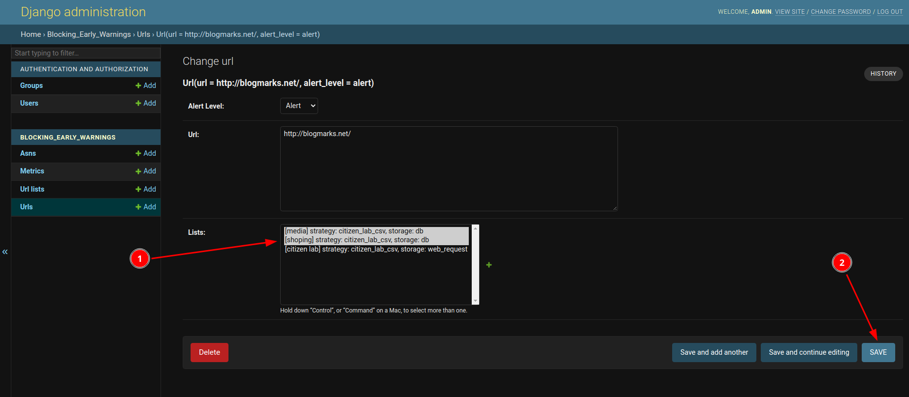

# URL Lists

One of the key features of the Early Warnings system is the hability to schedule measurements 
for specific urls that might be interesting. Also, the way those urls are loaded might be different
between use cases. For this reason, we provide at the least 3 ways to provide a list of urls according of 
it's storage type. 

##  Storage types

Lists can specify their type of storage, (where they are loaded from). This way you can provide it with a path in your local
disk where you edit the list's urls on the fly, or you can use a third party list like [citizen lab's](https://github.com/citizenlab/test-lists). Or you can simply
go into the admin panel and add urls manually to a database-stored list. 

### Database

The database (db) storage allows you to just add urls to this list from the webpage. To add an URL to a database list, you go to the 
url table in django admin panel:

And here you can find an existent url or add new one by clicking in the **"ADD URL +"** button and filling the required fields.
Either way, in the URL edition page you can add this url to a list by selecting the list itself and clicking save:

!!! Note
    The storage type is not important in this case since urls are just stored in the local database. **Specifying a storage type
    for a database-based list will result in an error**.

### Web request

This method will sync urls with a list that can be found by a web request to a specified url. The list should be provided as 
raw text and follow one of the supported formats. For example, we use the csv list maintained by Citizen lab that can be found
in `https://raw.githubusercontent.com/citizenlab/test-lists/master/lists/ve.csv`. This way the system can be kept in sync without human
intervention. This is useful in cases like this where the list is provided by a third party, or when you want the list publicly available 
so that multiple users can share the same list. Web Request lists are fetched in regular intervals to keep them on sync.

The valid **data formats** for a list are the following: 

* **Citizen Lab Csv** : a csv file that contains the url in the first column, just like [this](https://raw.githubusercontent.com/citizenlab/test-lists/master/lists/ve.csv) from citizen lab.

* **Url List Txt** : A txt file with a different url per line, for example:

            http://fncancer.org.ve/
            https://futuropresente.com.ve/
            http://www.orinoco.org/
            http://cedema.org/
            http://complotmagazine.com/
            http://dialogo-americas.com/
            https://globovision.com/
            http://nmidigital.com/
            http://www.descifrado.com/

### Local Storage

Is the same as a Web Request based, but the lists are retrieved from disk instead of using a web request, so you provide
an absolute path in the server's disk to a file with a supported format (same formats as web request).

## Creating a new list

To create a new list, go to the admin panel and select "Url lists" table:

Here you can manage your lists. In this case, we're going to create a new one. Click the **"ADD URL LIST +"** 
button in the top right corner of the page and we will go the list creation view: 

1. This field is just a **human-readable name** for your list, it should be unique among other lists
2. Here you specify how to retrieve the list content (see [storage types](#storage_types)). 
  
    1. If it is a **web request based**, then you use an url.  
    2. If it is **local storage based**, then you use an absolute path in your local disk
    3. If it is **Database based**, then ignore this field.

3. Parse strategy tells the system how to read the list files when the storage type is eiter **web request** or **local storage**. Ignore if not any of this.
4. This field tells the system how this list will store its urls.